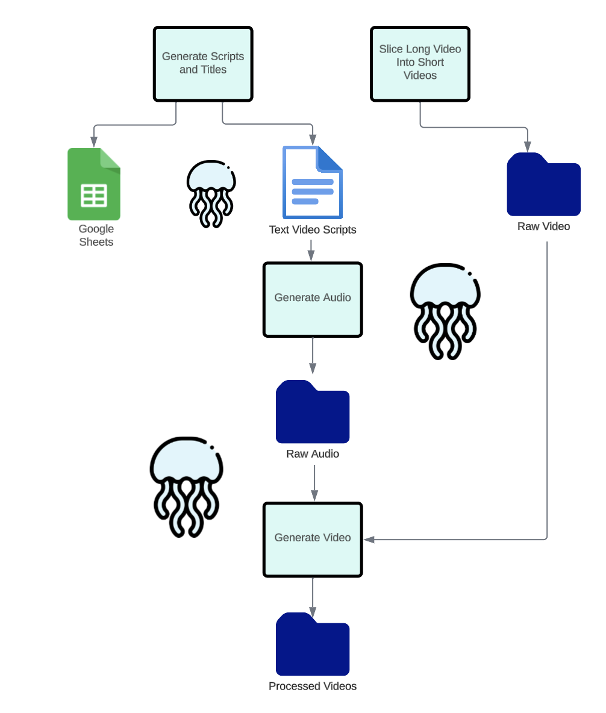
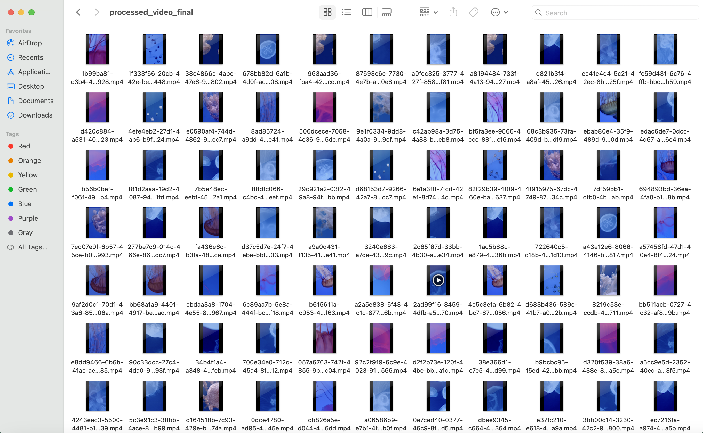
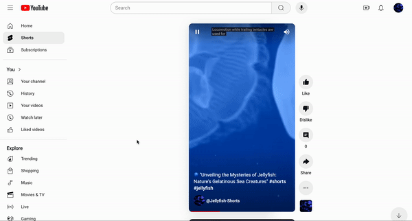

# Jellyfish GPT 

## AI Generated Educational Video Content About Jellyfish 
This project uses FFPMEG, OpenAI Assistants, and OpenAI TTS to create short educational videos about jellyfish. The purpose of purpose of this project is to explore how to quickly generate batches of high quality and factual content using an OpenAI assistant with a knowledge base, which can be used for educational purposes. 

I plan on creating more YouTube channels and content for educational purposes, as well as to raise awareness and even donations for causes that I care about. 
[[Checkout the YouTube Channel!]](https://www.youtube.com/watch?v=-zABWWJjvCc)

## Table of Contents
- [Files](#files)
- [Implementation](#implementation)  
- [Sources](#sources)
- [Motivation](#motivation)

## Files 

### configs.json 
Configs file that contains variables like prompts, filepaths, and model settings. 

### generate_youtube_videos.py 
Main script that has all functions to generate short form video content using OpenAI agents. 

### jellyfish_facts.txt
Factual information from the web, about jellyfish, used for the agents knowledge base. 

---
## Implementation

### Step #1: Add data to knowledge base
In order to create content that is based on facts and avoid LLM hallucinations, factual scientific information from the web is utilized to create a knowledge base for the agent.  This knowledge base is stored in a text file. Below is a snippet from the knowledge base:

> "Jellies play a vital role in ocean ecosystems. Not only do they eat plankton, but some are food for large animals like sea turtles. In Monterey Bay, for example, the enormous Pacific leatherback sea turtle travels across the Pacific Ocean, all the way from Indonesia, to feed specifically on sea nettles.
A recent study led by the Aquarium showed that jellies are also threatened by microplastics, and that they serve as an entry point for microplastics in the open ocean food chain. This shows how important jellies are as a food source for many animals."

### Step #2: Find a long and publicly available youtube video
Find a long video that is available to use freely. This longer video will serve as a background for the short videos we are creating. 

### Step #3: Slice long videos into shorter videos
FFMPEG was used to slice a longer video into shorter ones, as well as decrease or mute the volume of the original video. 

### Step #4: Generate video scripts, titles and metadata
Next step is to create YouTube scripts and titles using our OpenAI agent. The script is later converted to audio, to create the narration for the video. OpenAI API assistants were used to generate the text, and well as the Google Sheets API to store the metadata. The reason I chose to use Google Sheets, and not a database, is because it is easier to copy data from a google sheet into the YouTube UI. (I would automate the uploading of the YouTube videos; however, YouTube will block videos uploaded via the API). 

#### Metadata
| Column Name         | Description          |
|---------------------|----------------------|
| VIDEO_SCRIPT_PROMPT | The prompt used to generate the video script        |
| VIDEO_SCRIPT        | The actual script of the video        |
| NUM_CHARS_SCRIPT    | Number of text characters in script        |
| NUM_WORDS_SCRIPT    | Number of words in script        |
| VIDEO_TITLE_PROMPT  | Prompt to generate title       |
| VIDEO_TITLE         | The generated title       |
| NUM_CHARS_TITLE     | Number of text characters in title        |
| NUM_WORDS_TITLE     | Number of words in title        |
| INFERENCE_ID        | A unique ID used to keep track of text, video, and audio files used for the same video       |
| GPT_ASSISTANT_ID    | ID to pull jellyfish assistant       |
| DATE_TIME           | Timestamp       |
| COST_OF_INFERENCE   | Calculated total cost of inference in dollars, including text and audio generation       |
| GPT_BASE_MODEL      | Model used       |
| INFERENCE_TIME      | Time for text generation start to finish        |

Metadata about the inference turned out to be useful when experimenting with prompts, which is something I learned from my job. 

#### Example of prompts
Script Prompt:
> Can you briefly explain the reproduction of jellyfish? If information is not contained in the document, skip the question, and explain something you do know. Do not say what information is or is not contained in the document provided. Keep your response concise, and less than 150 words.

Response:
> "Jellyfish reproduction is fascinating! They have a two-stage life cycle: the polyp stage and the medusa stage. In the polyp stage, they can reproduce asexually by budding, which is like cloning. However, when they are mature jellyfish, or medusae, they reproduce sexually by releasing eggs and sperm into the water to create larval jellyfish called planulae. These planulae then settle on a surface and grow into new polyps, starting the cycle all over again. Nature's pretty amazing, right?"

Title Prompt: 
>"System: You are a helpful assistant who creates youtube video titles. Only return the one YouTube title, and nothing else, based on the video transcript. Keep the length of the title less than 80 characters.
User: {Transcript}

Response (After adding emojis and hashtags):
> 🪼 "Understanding the Two-Stage Reproduction Cycle of Jellyfish" #shorts #jellyfish

### Step #5: Generate audio data
Once the video scripts are complete in text format, the audio is generated from the text, and saved to a directory.

### Step #6: Merge and edit short videos with audio using FFMPEG 
Short videos are merged, trimmed, cropped, and faded using FFMPEG. A one minute background video is randomly selected from the batch, and merged with the audio iteratively.

### Step #7: Upload videos to YouTube
There is now 2 main components to upload the videos: 
1. The Google Sheet: Used to copy and paste video title into YouTube UI
2. Directory of final videos.

## Sources
These are the sources used to create the knowledge base, used to ensure factual information in the videos.
 
- https://www.montereybayaquarium.org/animals/animals-a-to-z/jellies?gclid=CjwKCAiA6byqBhAWEiwAnGCA4IPlxw4o3J9X3A-D4msmsEMHDF2z-DdQIZY5xrXtyn7b6XkGlYsLiRoC7d4QAvD_BwE
- https://www.mbari.org/news/
- https://www.mbari.org/animal/bloody-belly-comb-jelly/
- https://www.mbari.org/news/how-comb-jellies-adapted-to-life-in-the-deep-sea/
- https://www.mbari.org/news/ctenophores-the-story-of-evolution-in-the-oceans/
- https://ocean.si.edu/ocean-life/invertebrates/jellyfish-and-comb-jellies#section_16508

## Motivation
The purpose of this project is to share interesting facts about jellyfish for entertainment and educational purposes. If you love wild animals like jellyfish too, please donate to the wild animal initiative, which seeks to reduce harm caused to animals in the wild. 

https://www.wildanimalinitiative.org/donate 

[More code clean up coming soon]

