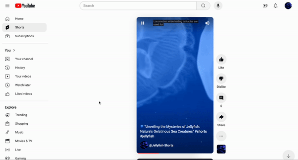

# Jellyfish GPT 
[[Checkout the YouTube Channel!]](https://www.youtube.com/watch?v=-zABWWJjvCc)
## AI Generated Educational Video Content About Jellyfish 
This project uses FFPMEG, OpenAI Assistants, and OpenAI TTS to create short educational videos about jellyfish. The purpose of purpose of this project is to explore how to quickly generate batches of high quality video content, which can be used for educational purposes. 

## Table of Contents
- [Example](#example)
- [Motivation](#motivation)
- [Implementation](#implementation)

## Example

Ask the jellyfish expert:
> Can you briefly explain the reproduction of jellyfish? If information is not contained in the document, skip the question, and explain something you do know. Do not say what information is or is not contained in the document provided. Keep your response concise, and less than 100 words.

Expert response:
> "Jellyfish reproduction is fascinating! They have a two-stage life cycle: the polyp stage and the medusa stage. In the polyp stage, they can reproduce asexually by budding, which is like cloning. However, when they are mature jellyfish, or medusae, they reproduce sexually by releasing eggs and sperm into the water to create larval jellyfish called planulae. These planulae then settle on a surface and grow into new polyps, starting the cycle all over again. Nature's pretty amazing, right?"

Video Title: 
> 🪼 "Understanding the Two-Stage Reproduction Cycle of Jellyfish" #shorts #jellyfish

Video result:

## Motivation
I enjoy watching YouTube videos, so I wanted to create my own using AI. YouTube is a large platform where a single video could be seen by thousands of people. My long term goal is to have a number of different channels that promote charities. I can quickly generate a high volume of content with the purpose of raising money to help solve important issues. For this initial video I have added in the description a link to a charity to help reduce harm caused to animals in the wild. 

--- 
### Video Description Example

Please donate to protect wild animals: https://www.wildanimalinitiative.org/donate

🪼Jellyfish are mesmerizing creatures! 

🪼 This channel is dedicated to sharing interesting facts about jellyfish for entertainment and educational purposes. 

🪼 If you enjoy these videos, please like, comment and subscribe for more jellyfish content. I create daily jellyfish content. 

🪼 If you love wild animals like jellyfish too, please donate to the wild animal initiative, which seeks to reduce harm caused to animals in the wild.

Disclaimer:
The video content provided herein is used for educational and informational purposes only, with the intent of promoting awareness and appreciation for the animals depicted. This content is not monetized, and no financial gain is derived from its use.

I acknowledge that the original footage belongs to the creator and full credit goes to the original creator. The use of this footage is based on the principle of Fair Use, and I have provided a link to the original content below to ensure due credit is given.

Original Video: https://www.youtube.com/watch?v=I6yC840UJ2Y

If you are the rightful owner of the original footage and wish for it to be removed, please contact me directly and I will promptly address your concerns.

## Implementation

